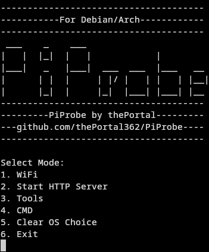

# PiProbe

> [!WARNING]
> __Do not use any of the features this script provides if you don't know what you're doing, as this can pose risk to your and other devices. I do not condone any illegal activity!__

> [!WARNING]
> __The Rootless Version is not fully functional and will not receive the latest Updates. (Last Update: Jan 1 2025)__

__For Problems, Questions, etc: mail me on: theportalprogrammer@gmail.com__

## Install (Debian):
  
  ### Install git:

    sudo apt install git -y

  ### Clone this Repository:

    git clone https://github.com/thePortal362/PiProbe.git

  ### Change into cloned Repository:

    cd PiProbe

  ### Run the Script with Sudo:

    sudo python3 main.py

  ### or the rootless Version:

    python3 rootless.py

## Install (Arch):

__Some Functions might not work on arch!__

  ### Install git:

    sudo pacman -S git

  ### Clone this Repository:

    git clone https://github.com/thePortal362/PiProbe.git

  ### Change into cloned Repository:

    cd PiProbe

  ### Run this Script with Sudo:

    sudo python3 main.py

  ### or the rootless Version:

    python3 rootless.py

## Install (Fedora):

__Some functions might not work on Fedora!__

  ### Install Git:

    sudo dnf install git -y

  ### Clone this Repository:

    git clone https://github.com/thePortal362/PiProbe.git
        
  ### Change into cloned Repository:

    cd PiProbe

  ### Run this Script with Sudo:

    sudo python3 main.py

  ### or the rootless Version:

    python3 rootless.py

## Setup for quick wifite attack:
  ____
  __You need to put an wordlist named wrdlist.txt into the PiProbe Folder.__
  __The normal attack will use the default wordlist included with wifite.__
  ____
  
## Quick Fixes:

  ### -Make sure you have a fully working linux distribution installed, for all functions to work properly you need a _debian_ based distribution. I am still working on the compatibility with _arch_.
 
  ### -Make sure you have python installed and on the newest version:
  
  Debian:
    
      sudo apt install python3
    
  Arch:
    
      sudo pacman -S python3
    
  Fedora:
     
      sudo dnf install python3

  ### -Some Features need extra programms, those may need to be installed manually

  

